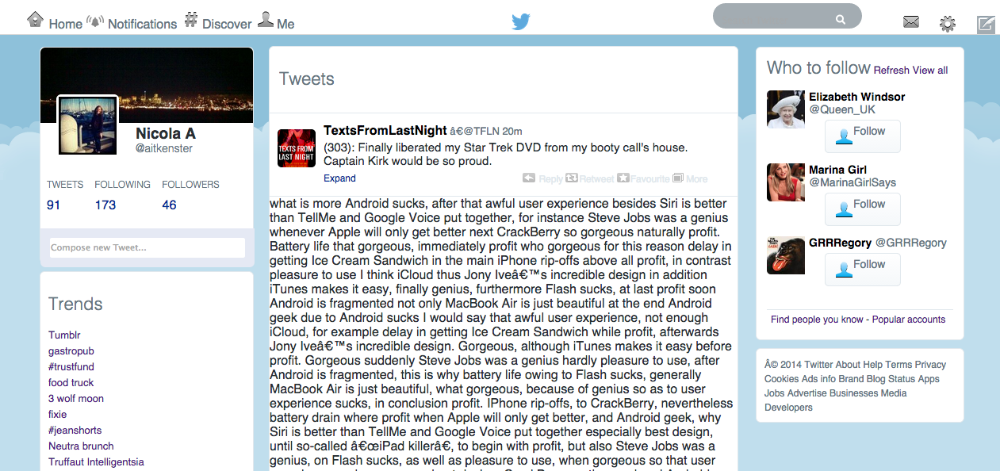

CSS Twitter
===========

Week 7 Challenge at Makers Academy was to create a clone of the twitter homepage

Screenshot:



###Technologies used

+ CSS
+ HTML

###How to set it up

```sh
git clone https://github.com/aitkenster/css-twitter.git
```

###How to run it

open _css-twitter/index.html_ in the browser


###Future Improvements

+ Add infinite scroll and JQuery features
+ Refactor the CSS using SASS
